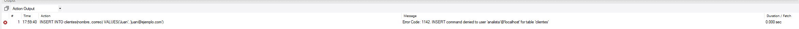

# Administracion, seguridad y mantenimiento

## Ejercicio 7: Gestion de Permisos

**Crear un usuario analista que solo pueda hacer SELECT en ciertas tablas. Intentar insertar desde ese usuario y explicar el resultado.**

```sql
CREATE USER 'analista'@'localhost' IDENTIFIED BY '123456';

GRANT SELECT ON bd2.clientes TO 'analista'@'localhost';

GRANT SELECT ON bd2.productos TO 'analista'@'localhost';

FLUSH PRIVILEGES;
```

Dado que se está utilizando el usuario 'analista', el cual no cuenta con los permisos necesarios para realizar operaciones de inserción (INSERT), se genera el siguiente error:

**Error:**


**Consulta SQL utilizada:**

```sql
INSERT INTO clientes(nombre, correo) VALUES('Juan', 'juan@ejemplo.com');
```

## Ejercicio 8: Seguridad y Auditoria

**Simular una auditoria simple con triggers que registren toda modificacion en una tabla Clientes.**

```sql
CREATE TABLE clientes_auditoria (
    id INT AUTO_INCREMENT PRIMARY KEY,
    accion VARCHAR(20),
    cliente_id INT,
    datos_viejos JSON,
    datos_nuevos JSON,
    fecha TIMESTAMP DEFAULT CURRENT_TIMESTAMP
);
```

```sql
DELIMITER !!
CREATE TRIGGER t_auditoria_clientes
AFTER UPDATE ON clientes
FOR EACH ROW
BEGIN
    INSERT INTO clientes_auditoria (
        accion,
        cliente_id,
        datos_viejos,
        datos_nuevos,
        fecha
    ) VALUES (
        'UPDATE',
        OLD.id,
        JSON_OBJECT('nombre', OLD.nombre, 'email', OLD.email),
        JSON_OBJECT('nombre', NEW.nombre, 'email', NEW.email),
        CURRENT_TIMESTAMP
    );
END!!

DELIMITER ;
```
