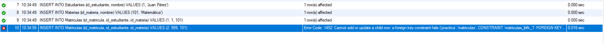

# Fundamentos, Integridad y Concurrencia


### 1)

**Suponiendo que tenemos estas dos tablas:**

`Estudiantes(id_estudiante,nombre,legajo)`
`Materias(id_materia,id_estudiante,nombre)`

**La tabla Materias hace referencia a la tabla Estudiantes y en el caso que se elimine un estudiante va a permanecer la informacion en la tabla Materias. Para evitar este tipo de problemas debemos utilizar restricciones de clave foránea es decir:**

`FOREIGN KEY (id_estudiante) REFERENCES Estudiantes(id_estudiante) ON DELETE RESTRICT`

**En este caso evita que se borre un estudiante si tiene inscripciones**

**Si usamos `ON DELETE CASCADE` en el momento que se borre un estudiante se eliminara sus Materias referenciadas**

### 2)

**Tablas utilizadas:**


```
    CREATE TABLE Estudiantes(
        id_estudiante INT PRIMARY KEY,
        nombre VARCHAR(50)
    );
    CREATE TABLE Materias(
        id_materia INT PRIMARY KEY,
        nombre VARCHAR(60)
    );
    CREATE TABLE Matriculas (
        id_matricula INT PRIMARY KEY,
        id_estudiante INT,
        id_materia INT,
        FOREIGN KEY (id_estudiante) REFERENCES Estudiantes(id_estudiante),
        FOREIGN KEY (id_materia) REFERENCES Materias(id_materia)
    );
```
**Error:**


```
10:34:55	INSERT INTO Matriculas (id_matricula, id_estudiante, id_materia) VALUES (2, 999, 101)	Error Code: 1452. Cannot add or update a child row: a foreign key constraint fails (`practica`.`matriculas`, CONSTRAINT `matriculas_ibfk_1` FOREIGN KEY (`id_estudiante`) REFERENCES `estudiantes` (`id_estudiante`))	0.016 sec
```

### 3)

**Supongamos que tenemos las siguiente tabla:**

```
    CREATE TABLE Cuentas(
        id_cuenta INT PRIMARY KEY,
        saldo DECIMAL
    );

    INSERT INTO Cuentas VALUES(1,100);
```

**Transaccion 1: retira $100**

**Transaccion 2: retira $50**

**En el caso de READ COMMITED T1 y T2 leen el mismo saldo inicial**

- T1 resta $100 y guarda $0
- T2 resta $50 y guarda $50

**Entonces el saldo final seria $50 por mas que se haya retirado de mas ya que ambas transacciones leyeron al mismo tiempo que tenian una misma cantidad de saldo sin haber contemplado el hecho de que se esten haciendo varias simultaneamente.**

**SERIALIZABLE**

**En este caso se respeta un orden de llegada con un sistema de turnos haciendo que se respete el saldo existente. En el caso del ejemplo una vez realizada la T1 no dejaria al usuario realizar la T2 ya que no tiene fondos.**